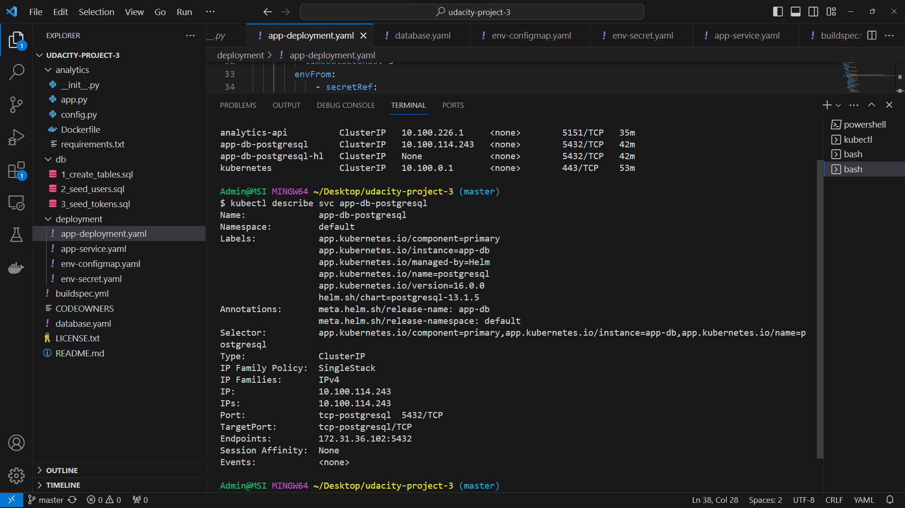

# Coworking Space Service Extension
The Coworking Space Service is a set of APIs that enables users to request one-time tokens and administrators to authorize access to a coworking space. This service follows a microservice pattern and the APIs are split into distinct services that can be deployed and managed independently of one another.

For this project, you are a DevOps engineer who will be collaborating with a team that is building an API for business analysts. The API provides business analysts basic analytics data on user activity in the service. The application they provide you functions as expected locally and you are expected to help build a pipeline to deploy it in Kubernetes.

## Getting Started
 
### Dependencies
#### Local Environment
1. Python Environment - run Python 3.6+ applications and install Python dependencies via `pip`
2. Docker CLI - build and run Docker images locally
3. `kubectl` - run commands against a Kubernetes cluster
4. `helm` - apply Helm Charts to a Kubernetes cluster

#### Remote Resources
1. AWS CodeBuild - build Docker images remotely
2. AWS ECR - host Docker images
3. Kubernetes Environment with AWS EKS - run applications in k8s
4. AWS CloudWatch - monitor activity and logs in EKS
5. GitHub - pull and clone code

### How deployment process works:
1. AWS CodeBuild will be triggered by push action of user to Github Repo.
2. AWS CodeBuild Service conducts pre-build, build, and post-build actions to rebuild the image and publish it to AWS ECR Repository
3. AWS EKS will use newly built image to deploy on application service

### How the user can deploy changes:
1. Modify and push changes of the application to the GitHub Repo
2. Check the latest tag of deployed image from AWS ECR Repo
3. Access into 'deployment' folder and modify the latest tag of image collect from step 2
4. Check the status of new deployment with some kubectl commands

### CloudWatch Metrics in EKS
Kubernetes clusters created with EKS are set up to integrate with CloudWatch Container Insights by default.

This captures common sets of metrics such as CPU, memory, disk usage, and network traffic details. Additional data such as container diagnostic data is also captured.

Configuring CloudWatch Insights CloudWatch insights are easy to configure on your cluster.

1. Node Role Policy Your policy for your EKS node role should include CloudWatchAgentServerPolicy for the agent to properly forward metrics.
2. Install CloudWatch Agent In the following command, replace <YOUR_CLUSTER_NAME_HERE> on line 1 with the name of your EKS cluster and replace <YOUR_AWS_REGION_HERE> on line 2 with your AWS region. Then, run the command on an environment that has kubectl configured.

```bash
ClusterName=<YOUR_CLUSTER_NAME_HERE>
RegionName=<YOUR_AWS_REGION_HERE>
FluentBitHttpPort='2020'
FluentBitReadFromHead='Off'
[[ ${FluentBitReadFromHead} = 'On' ]] && FluentBitReadFromTail='Off'|| FluentBitReadFromTail='On'
[[ -z ${FluentBitHttpPort} ]] && FluentBitHttpServer='Off' || FluentBitHttpServer='On'
curl https://raw.githubusercontent.com/aws-samples/amazon-cloudwatch-container-insights/latest/k8s-deployment-manifest-templates/deployment-mode/daemonset/container-insights-monitoring/quickstart/cwagent-fluent-bit-quickstart.yaml | sed 's/{{cluster_name}}/'${ClusterName}'/;s/{{region_name}}/'${RegionName}'/;s/{{http_server_toggle}}/"'${FluentBitHttpServer}'"/;s/{{http_server_port}}/"'${FluentBitHttpPort}'"/;s/{{read_from_head}}/"'${FluentBitReadFromHead}'"/;s/{{read_from_tail}}/"'${FluentBitReadFromTail}'"/' | kubectl apply -f -
```
This will install CloudWatch insights into the namespace amazon-cloudwatch on your cluster.

After this is configured, you can navigate to CloudWatch in the AWS console to access CloudWatch Insights.

## Project Instructions
1. Set up a Postgres database with a Helm Chart
2. Create a `Dockerfile` for the Python application. Use a base image that is Python-based.
3. Write a simple build pipeline with AWS CodeBuild to build and push a Docker image into AWS ECR
4. Create a service and deployment using Kubernetes configuration files to deploy the application
5. Check AWS CloudWatch for application logs

### Deliverables
1. `Dockerfile`
analytics\Dockerfile
2. Screenshot of AWS CodeBuild pipeline

3. Screenshot of AWS ECR repository for the application's repository

4. Screenshot of `kubectl get svc`

5. Screenshot of `kubectl get pods`

6. Screenshot of `kubectl describe svc <DATABASE_SERVICE_NAME>`

7. Screenshot of `kubectl describe deployment <SERVICE_NAME>`

8. All Kubernetes config files used for deployment (ie YAML files)
9. Screenshot of AWS CloudWatch logs for the application

10. `README.md` file in your solution that serves as documentation for your user to detail how your deployment process works and how the user can deploy changes. The details should not simply rehash what you have done on a step by step basis. Instead, it should help an experienced software developer understand the technologies and tools in the build and deploy process as well as provide them insight into how they would release new builds.

